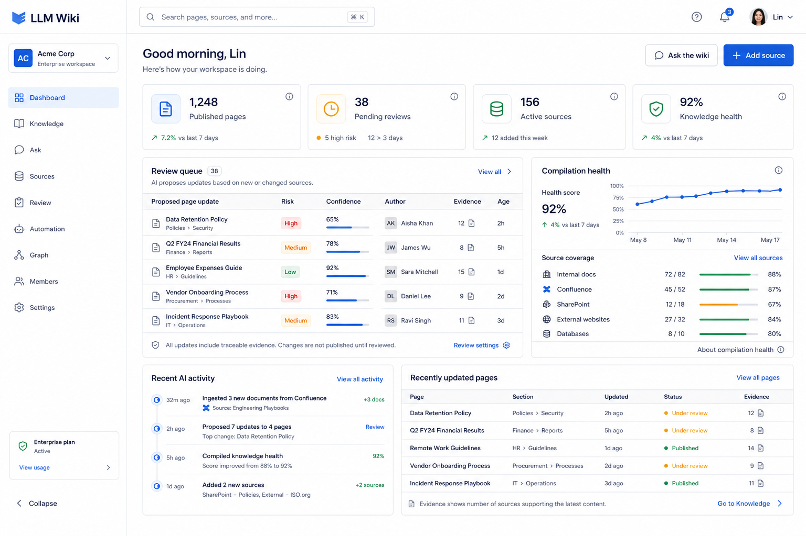
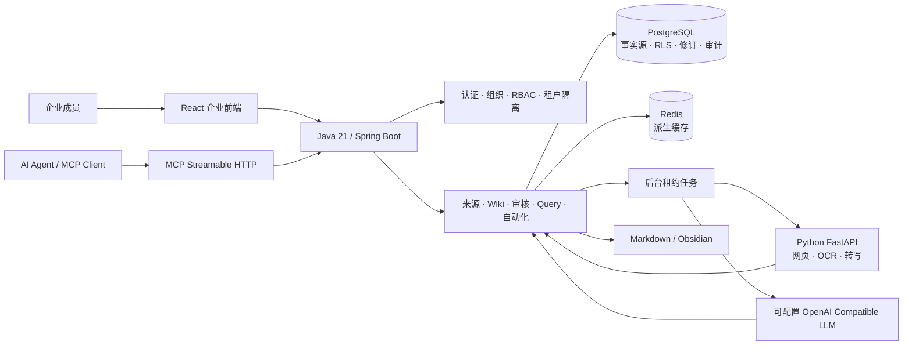

<div align="center">

# Enterprise LLM Wiki

### 企业智库

**由多位成员共同提供资料，由 AI 持续编译和维护，所有结论均可追溯、可审核。**

[](https://openjdk.org/)
[](https://spring.io/projects/spring-boot)
[](https://react.dev/)
[](https://www.postgresql.org/)
[](https://www.python.org/)

[功能](#核心功能) · [架构](#系统架构) · [快速开始](#快速开始) · [接口文档](docs/API.md) · [完整架构说明](docs/ARCHITECTURE.md)

</div>



> 当前项目处于持续开发阶段。截图为企业工作台设计基线，实际界面与功能会继续演进。

## 项目定位

Enterprise LLM Wiki 是 [Karpathy llm-wiki 方法论](https://gist.github.com/karpathy/442a6bf555914893e9891c11519de94f) 的企业应用化实现。

它不是“上传文档后临时检索”的普通 RAG 系统，而是把来源持续编译成长期维护的 Wiki：知识会形成页面、关系、修订和证据链；AI 可以持续发现过时信息与矛盾，但已有知识的修改必须通过人工审核。

```text
成员提供资料 → 内容提取 → AI 编译 → 知识页面/关系 → 人工审核 → 发布修订
                                  ↓
                         问 Wiki / MCP / Obsidian 导出
```

## 核心功能

| 模块 | 能力 |
|---|---|
| 企业协作 | 组织、工作空间、多成员、角色与权限管理 |
| 租户隔离 | PostgreSQL FORCE RLS、事务级租户上下文、显式租户键 |
| 资料来源 | 文本、网页、文件拖拽上传、PDF/DOCX、OCR、音视频转写、下载与刷新 |
| AI 知识编译 | 从不可变来源版本生成主题、实体、综合页面和 WikiLink |
| 审核发布 | 已有知识更新、知识删除、关系删除统一进入审核流程 |
| 证据追溯 | 页面修订、来源版本、证据、变更集、审核与审计记录完整关联 |
| 问 Wiki | 持久化历史会话、引用回答、大模型开关、重命名、置顶和删除 |
| 持续优化 | 定期扫描矛盾和过时内容，生成审核提案并保留运行记录 |
| AI 定时任务 | 按每天、每周或固定间隔查询模型最新信息并进入知识编译流程 |
| 知识图谱 | 节点筛选、缩放、拖拽和弹窗式知识浏览 |
| MCP | Streamable HTTP JSON-RPC，支持查询、来源、页面和审核工具 |
| 通用导出 | 导出 Markdown、WikiLink 和 Obsidian 可识别的 Vault 压缩包 |
| 缓存与任务 | Redis 派生缓存、数据库租约、指数退避、SKIP LOCKED、多实例接管 |

## 系统架构



### 知识更新原则

1. 来源与来源版本不可变，并使用 SHA-256 标识内容。
2. PostgreSQL 是唯一事实源；Markdown 和 Obsidian 是导出投影。
3. 已发布页面的任何更新或删除都必须审核。
4. 修订、证据、审核、审计和 Outbox 在同一事务提交。
5. Python 和 LLM 网络调用在数据库事务之外执行。

完整设计见 [docs/ARCHITECTURE.md](docs/ARCHITECTURE.md)。

## 技术栈

| 层级 | 技术 |
|---|---|
| Web | React 19、TypeScript、Vite、TanStack Query、React Router |
| Server | Java 21、Spring Boot 3.4、Spring JDBC、Flyway |
| Worker | Python 3.11+、FastAPI、BeautifulSoup、PyPDF、python-docx |
| Storage | PostgreSQL、Redis、本地对象存储（可演进为 S3/MinIO） |
| AI | OpenAI Compatible API，可按工作空间配置和测试 |
| Protocol | REST API、MCP Streamable HTTP JSON-RPC |

## 项目结构

```text
enterprise-llm-wiki/
├─ server/          Java 后端、领域服务、Flyway 迁移
├─ web/             React 企业前端与浏览器流程
├─ python-worker/   网页提取、OCR、文档解析和音视频转写
├─ docs/            架构与接口文档
├─ scripts/         数据库准备、启动、停止和联调脚本
└─ showcase/        GitHub 展示素材
```

## 快速开始

### 1. 环境要求

- Java 21
- Maven 3.9+
- Node.js 20+
- Python 3.11+
- PostgreSQL 16+
- Redis（可选；不可用时自动回源 PostgreSQL）

### 2. 准备依赖

```powershell
Set-Location web
npm install

Set-Location ..\python-worker
python -m venv .venv
.\.venv\Scripts\python -m pip install -e ".[test]"

Set-Location ..
```

### 3. 创建数据库

默认连接为 `localhost:5432/llm_wiki`，开发用户名 `postgres`、密码 `123456`，均可通过环境变量覆盖。

```powershell
.\scripts\provision-database.ps1
```

### 4. 启动全部服务

```powershell
.\scripts\start-local.ps1
```

| 服务 | 地址 |
|---|---|
| Web | http://127.0.0.1:5173 |
| Java API | http://127.0.0.1:8123 |
| Python Worker | http://127.0.0.1:8101 |
| 健康检查 | http://127.0.0.1:8123/actuator/health |

开发环境账号和密码均为 `1`。该凭据只允许本机开发使用。

停止服务：

```powershell
.\scripts\stop-local.ps1
```

更多配置项见 [.env.example](.env.example)。本机专用覆盖可写入 `server/src/main/resources/application-local.yml`，该文件已被 Git 忽略。

## API 与 MCP

REST API 默认根地址：`http://127.0.0.1:8123`。

| 接口组 | 路径 | 说明 |
|---|---|---|
| 认证 | `/api/auth/*` | 登录、刷新、退出、空间切换、API Key |
| 来源 | `/api/sources/*` | 创建、上传、下载、刷新与列表 |
| Wiki | `/api/pages/*` | 页面、详情、修改提案、删除与关系操作 |
| 查询 | `/api/query/*` | 问 Wiki、历史会话、模型状态 |
| 审核 | `/api/reviews/*` | 审核队列、批准与驳回 |
| 自动化 | `/api/automation/*` | 模型配置、持续优化、AI 定时任务与运行记录 |
| 图谱 | `/api/graph` | 当前空间知识图谱快照 |
| 导出 | `/api/export/obsidian` | Obsidian 兼容 ZIP |
| MCP | `/mcp` | Streamable HTTP JSON-RPC |

完整请求说明、权限和示例见 [接口文档](docs/API.md)。

MCP 使用 JWT 或可撤销的 `lwk_` API Key：

```json
{
  "mcpServers": {
    "enterprise-llm-wiki": {
      "url": "http://127.0.0.1:8123/mcp",
      "headers": {
        "Authorization": "Bearer lwk_your_api_key"
      }
    }
  }
}
```

当前提供的 MCP 工具：

- `llm_wiki_query`
- `llm_wiki_list_pages`
- `llm_wiki_propose_page`
- `llm_wiki_add_text_source`
- `llm_wiki_review_change`

## 安全边界

- 不使用 Spring Security，认证与授权由显式拦截器、数据库会话和 RBAC 完成。
- 内容表启用 PostgreSQL `FORCE ROW LEVEL SECURITY`。
- 模型 API Key 使用 AES-GCM 加密后保存。
- 刷新令牌仅通过 HttpOnly Cookie 传递，数据库只保存摘要。
- Git 仓库不提交 `.env`、本地覆盖配置、日志、原始资料、上传对象和模型密钥。

## 开发状态

当前已完成企业版主流程，后续重点包括：

- 对象存储切换到 S3/MinIO
- 更丰富的网页来源适配器
- 向量索引作为可选派生检索层
- 容器化部署和 CI/CD
- 更完整的监控、告警与运行指标

## 致谢

项目核心理念来自 Andrej Karpathy 提出的 [llm-wiki](https://gist.github.com/karpathy/442a6bf555914893e9891c11519de94f)：让模型持续编译和维护知识，而不是每次查询都重新阅读全部原始资料。
