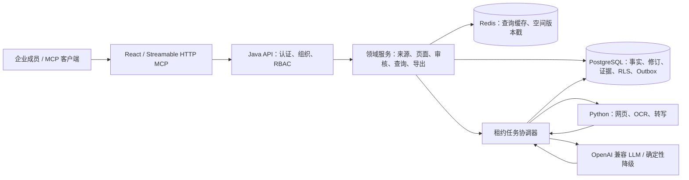
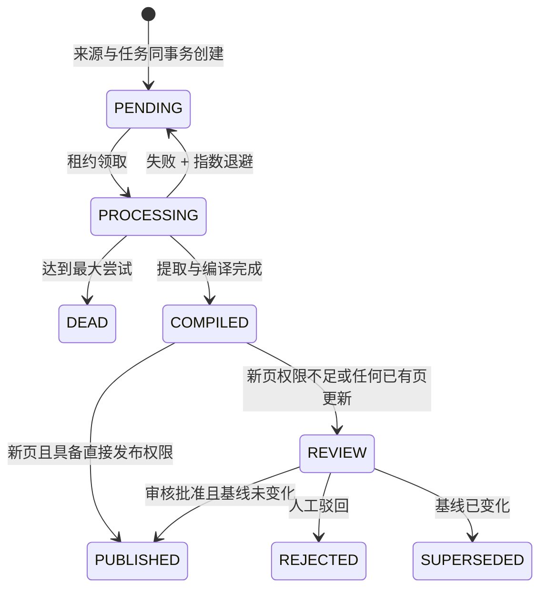

# LLM Wiki Enterprise 架构

## 1. 边界

系统采用模块化单体 Java 服务承载强事务业务，以独立 Python 服务隔离不稳定、依赖重的内容处理，以 React 提供企业协作界面。

空间模型配置保存在 `workspace_model_settings`，API Key 使用 AES-GCM 随机 IV 加密。数据库空间配置优先于环境变量，并可显式关闭环境回退；Query、来源编译与后台持续优化都通过同一模型解析器调用，避免不同流程使用不同模型。

## 2. 来源到知识

1. 成员登记文本、URL 或上传文件；来源与摄取任务同事务提交。
2. Worker 用 `SKIP LOCKED` 原子领取任务，提交后释放锁。
3. Python/LLM 在事务外提取和编译。
4. 完成短事务写入来源版本与变更集。
5. 若候选命中已有页面，状态永远为 `PENDING`。
6. 若是新页面，仅 `PAGE_CREATE_PUBLISH` 可直接发布；其他角色送审。
7. 审核批准锁定变更集与目标页，校验 `base_revision_id`；基线变化时标记 `SUPERSEDED`。
8. 新修订、当前页面投影、证据、关系、审核、审计和 Outbox 原子提交。

## 3. 多租户与权限

- JWT 声明只提供候选身份，每个请求仍校验数据库会话、用户、组织成员和空间成员状态。
- HttpOnly 刷新令牌以 SHA-256 摘要存储并在每次刷新时轮换。
- API Key 绑定用户、组织和空间，可撤销、可过期，权限实时读取 RBAC。
- 内容表启用 `FORCE RLS`。即使开发连接使用 `postgres`，租户事务也先 `SET LOCAL ROLE llm_wiki_app`，使超级用户特权在事务内降级，再设置事务本地组织/空间 ID。
- 管理关系表不依赖 RLS，但所有 SQL 显式包含组织/空间键，并由权限拦截器保护。
- 前端隐藏菜单只改善体验，后端控制器和 MCP 工具都会独立校验权限。

## 4. Query 优化

Query 流程按以下顺序：Unicode 规范化 → 空间版本缓存 → PostgreSQL `tsvector` + `pg_trgm` + 内容匹配 → 一次图邻居扩展 → 引用回答 → 查询运行记录。

中国文本在 `simple` 字典分词不足时仍可通过内容包含和标题三元组命中；后续可接入中文分词或 pgvector，但它们只作为派生索引，不替代编译 Wiki。

## 5. 一致性策略

- 所有领域写入口均使用 Spring `@Transactional`。
- 网络调用严格在事务外。
- 对既有页面以 `FOR UPDATE` + 基线修订 + 乐观 `version` 三重检查。
- 多页面审核先按页面 UUID 排序加锁，降低死锁风险。
- Outbox 与业务状态同事务；异步发布失败不改变已提交事实。
- Redis 使用工作空间 epoch 失效，不扫描通配键；Redis 故障只记录 `error` 并回源。

## 6. 持续优化与审核

管理员可按空间一键启停持续优化，最短周期为 30 分钟。调度器每分钟扫描一次到期空间，通过部分唯一索引保证每个空间最多只有一轮活动任务，并通过租约支持多实例故障接管。

每轮优先选择从未巡检或最久未巡检的页面，以固定批次轮转覆盖整个 Wiki，而不是永远重复最近页面。页面快照带出事务后交给 AI，结果回库时重新锁定页面并校验基线修订。AI 只能针对已有页面创建 `MAINTENANCE` 变更集，不能直接修改已发布正文；审核批准后才由统一发布事务生成新修订。`wiki_evolution_runs` 永久记录触发方式、模型、扫描页数、矛盾详情、审核单、成功/跳过/失败状态和结果摘要。关闭开关会取消尚未领取的定时任务，但不粗暴中断已经运行的外部模型请求。

## 7. AI 定时任务

管理员可以为当前空间创建每天、每周或固定间隔执行的 AI 资料任务。启用任务前必须存在已经测试通过的模型配置；调度器通过数据库部分唯一索引和租约保证同一任务最多只有一条活动运行，多实例可以在租约过期后接管。

模型返回的 Markdown 不会直接覆盖 Wiki，而是创建类型为 `TEXT` 的不可变来源和摄取任务，随后复用统一的知识编译、证据和审核链路。运行记录保存触发方式、状态、模型、生成来源、摄取任务、结果摘要和失败原因；摄取完成或进入死信后会反向更新运行结果，避免只记录“模型调用成功”而隐藏后续编译失败。

## 8. Markdown 与 Obsidian

Wiki 正文仍是 Markdown，但数据库保存当前投影和不可变修订。导出生成：

- `README.md`、`context.md`
- `topics/`、`entities/`、`synthesis/`、`queries/`
- YAML frontmatter、稳定 ID、修订号、来源列表
- `_meta/index.md`、`_meta/audit.md`
- `.obsidian/app.json`、`.obsidian/graph.json`

导出只读，不支持把本地 Vault 与数据库双向同步，从根源避免双主写冲突。
